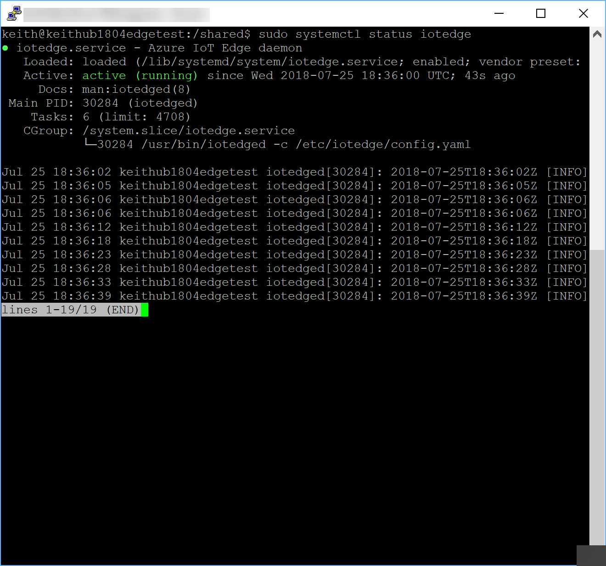
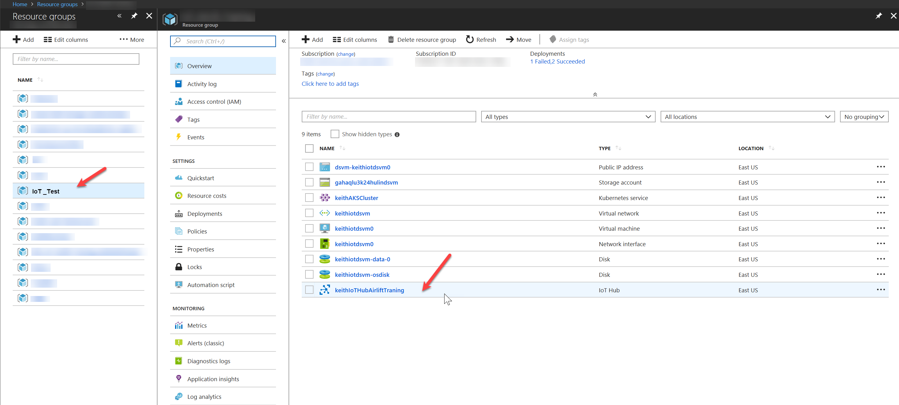
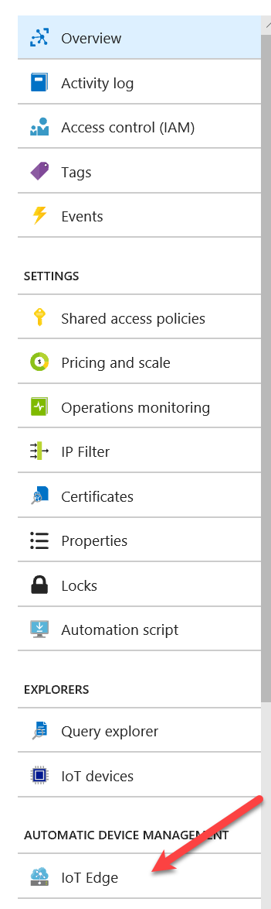
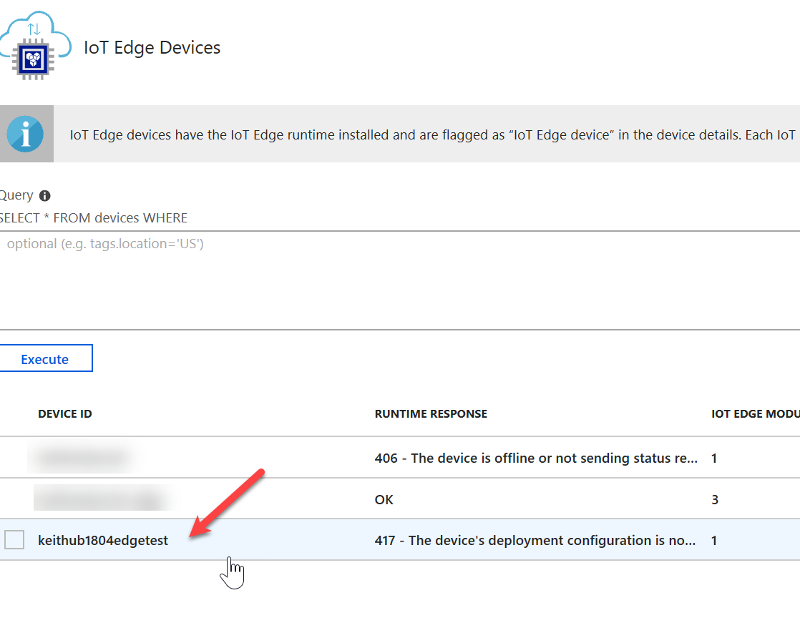
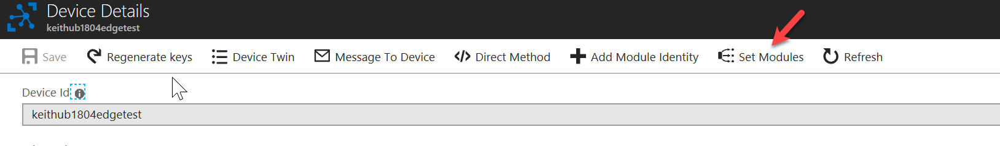
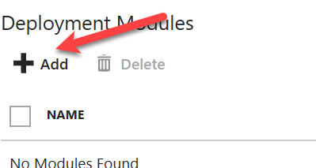
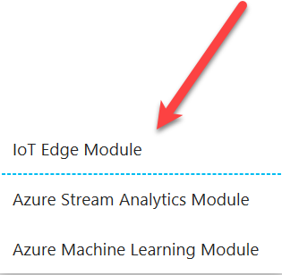
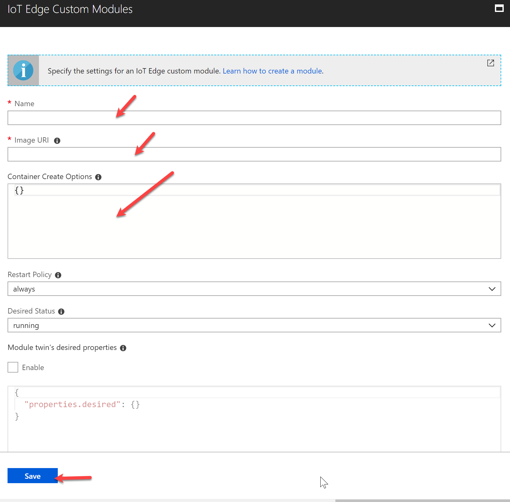

# Under Construction
- - -


# How to Install and Configure the OPC-UA Publisher on IoT Edge

- - -
## Assumptions
- - -
1.  An IoT Hub has been setup and configured in an Azure subscription that you have access to.  If you need to understand how to configure an IoT Hub see this [article](https://docs.microsoft.com/en-us/azure/iot-hub/iot-hub-create-through-portal).  
2.  An Azure IoT Edge device has been configured on a device that is running Linux.  
 - If you need to understand how to install IoT Edge on x64 see this [article](https://docs.microsoft.com/en-us/azure/iot-edge/how-to-install-iot-edge-linux).  
 - If you need help on how to install IoT Edge on Linux ARM32 see this [article](https://docs.microsoft.com/en-us/azure/iot-edge/how-to-install-iot-edge-linux-arm).

## Install the OPC-UA Publisher
- - - 

Once the Edge is running on a device (or VM) we need to ensure that it is healthy.  To do this run the following command
```bash
sudo systemctl status iotedge
```
You should see an output like you see below:

 

The part to pay attention to is the bit in green "active (running)"  This tells us that IoT Edge is installed and connected to an IoT Hub in Azure.

Next we need to create a file for the OPC Publisher configuration.  

From the shell prompt in the terminal session type the following:

```bash
sudo mkdir /shared
```
Now we need to create our file in this directory.  To do this we will type:
```bash
sudo nano /shared/pn.json
```
If nano is not your favorite editor...feel free to use what you like.

paste the following in the file.

```json
[
  {
    "EndpointUrl": "opc.tcp://1xx.1xx.1xx.1xx:",Port
    "UseSecurity": false,
    "OpcNodes": [
      {
        "Id": "ns=2;s=Channel1.Device1.Tag1",
        "OpcSamplingInterval": 2000,
        "OpcPublishingInterval": 5000
      }
    ]
  }
]
```
Enter your OPC-UA Server's IP address and port number for the "EndpointURL".  

Save this file.

The next step is to install the module for OPC-UA Publisher.  To do this you will need to log into the [Azure Portal](portal.azure.com).  Once you are on the Azure portal navigate to the resource group that holds your IoT Hub and select the IoT Hub.

 

On the IoT Hub blade select the IoT Edge on the left hand side.

 

On the IoT Edge blade find the IoT Edge device that we will be adding the OPC-UA Publisher to.

 

Select "Set Modules" at the top

 

Click on the Add as seen below:

 

Click on "Edge Module".

 

This will open a new fly out as scene below.

 

Here we will be filling in the following:

1.  Name
 - iot-edge-opc-publisher
2.  Image URI
 - microsoft/iot-edge-opc-publisher:latest
3.  Container Create Options
  - Enter the following replacing the port binding port to the one that you are using in your OPC server deployment.  Replace the <OPC Server Host Name and IP> with the OPC Server name and IP address as such:  “KeithOPCserver1.useast.cloudapp.azure.com:10x.2xx.6x.1”
```json
{
    "Hostname": "publisher",
    "Cmd": [
      "publisher",
      "--pf",
      "/cfg/pn.json",
      "--aa"
    ],
    "HostConfig": {
      "PortBindings": {
        "62222/tcp": [
          {
            "HostPort": "62222"
          }
        ]
      },
      "Binds": [
        "test_cfx509certstores:/root/.dotnet/corefx/cryptography/x509stores",
        "/shared:/cfg"
      ],
      "ExtraHosts": [
      "<OPC Server Host Name and IP>"
      ]
    }
  }
```
and click .

At the bottom of the blade you will see the , click next.

In the next section you will need to modify the route.  Enter the following:

```
{
  "routes": {
    "upstream": "FROM /* INTO $upstream"
  }
}
```
Click 

Click 

Click 

Check to see if the data is flowing in to the IoT hub.  To do this we will type the following command at the shell prompt on the 



Finally, for more information you can view this [article](https://github.com/Azure/iot-edge-opc-publisher).

1




















